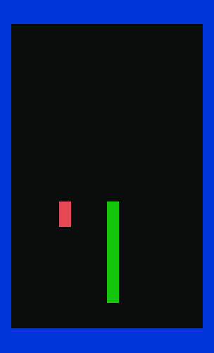

## Programmable Snake
This is my project for passing the "Intro to Programming" classes at Vistula University.

## How to play
Write the instructions you want the snake to do in the MOVES file. The instructions go as follows:
```
(L)eft
(D)own
(U)p
(R)ight
Any number - waits that many game turns before making any other moves.
```
Collecting apples (red tiles) makes the snake longer, so you'll quickly be running out of space. Good luck!

